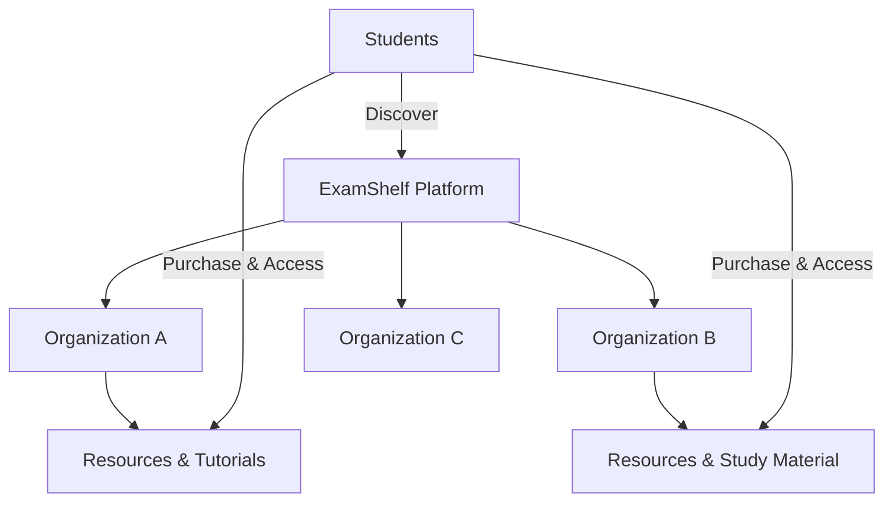
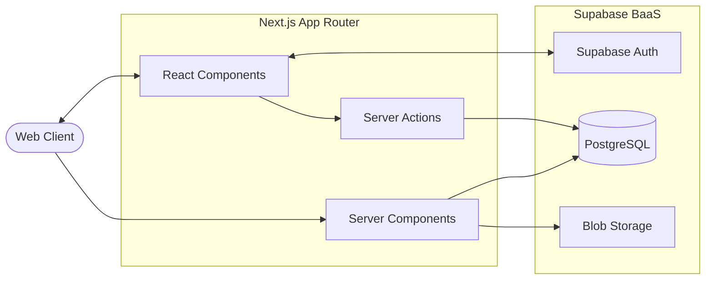

<div align="center">

# 📚 ExamShelf

**Academic resources, organized for the way students learn.**

[](https://nextjs.org/)
[](https://reactjs.org/)
[](https://developer.mozilla.org/en-US/docs/Web/JavaScript)
[](https://supabase.com/)
[](https://www.postgresql.org/)
[](https://tailwindcss.com/)

[Repository](https://github.com/Aradhy2005/ExamShelf) • [Report Issue](https://github.com/Aradhy2005/ExamShelf/issues) • [Author](https://github.com/Aradhy2005)

</div>

---

## 📖 Project Overview

ExamShelf is a full-stack, Next.js-driven academic resource platform designed to centralize educational content discovery, organization, and access. 

While initially developed with specific educational content in mind, the foundational architecture is actively being engineered as a multi-organization platform. This allows multiple educators, coaching institutes, and communities to eventually publish, manage, and distribute their study materials within a unified, secure ecosystem.

**Current Status:** *Actively under development.* The core foundation (authentication, database integration, UI routing, and secure client/server architecture) is currently established.

## 🎯 Problem Statement

The modern student's academic workflow is fragmented. Essential study materials are scattered across temporary messaging groups, expiring cloud storage links, disparate websites, and physical PDFs. This informal distribution model leads to:
* High friction in resource discovery
* Poor content organization and versioning
* Loss of access to historical study materials
* Lack of a unified platform for educators to distribute structured content

ExamShelf solves this by providing a centralized, secure platform where discovery, access, and organization happen in one place.

---

## 🔭 Product Vision

ExamShelf is designed as a scalable platform, not just a static notes website. The long-term architectural goal supports a multi-tenant ecosystem:



*Note: Multi-tenant organizational isolation is part of the roadmap and represents the architectural direction, rather than the currently implemented state.*

---

## ✨ Current Features

The current implementation provides a robust foundation for the student experience and application infrastructure:

**Student Experience**
* **Authentication:** Secure signup, login, password recovery, and email confirmation workflows.
* **Exploration:** Resource discovery interface utilizing categorized resource cards.
* **Resource Management:** Detailed resource pages and a dedicated tutorials section.
* **Account Management:** User profile management and dedicated purchases tracking area.

**Platform Foundation**
* **Next.js 16 Architecture:** Leveraging the App Router for optimized server-side rendering and static generation.
* **React 19 UI:** Modern, responsive component architecture styled with Tailwind CSS.
* **Supabase Integration:** Distinct client and server-side utilities to handle authentication states safely across SSR and client components.

**Security Foundation**
* **Environment Configuration:** Strict separation of environment variables.
* **Authorization Foundation:** Session-based route protection.
* **RLS Architecture:** Foundation laid for PostgreSQL Row Level Security (RLS) enforcement.

---

## 🏗 System Architecture

The application follows a modern Serverless / BaaS full-stack pattern, ensuring high performance and minimal infrastructure overhead.



---

## 💻 Technology Stack

| Layer | Technology | Purpose |
| :--- | :--- | :--- |
| **Framework** | Next.js 16 | Core framework, routing, SSR/SSG capabilities |
| **Frontend** | React 19, JavaScript | Component architecture and client-side logic |
| **Styling** | Tailwind CSS | Utility-first responsive UI design |
| **Backend / BaaS**| Supabase | Managed infrastructure and APIs |
| **Database** | PostgreSQL | Relational data modeling and queries |
| **Authentication**| Supabase Auth | Secure user identity and session management |
| **Storage** | Supabase Storage | PDF, image, and resource file hosting |
| **Security** | Row Level Security | Database-level access control (Foundation) |
| **Deployment** | Vercel | Global edge delivery and CI/CD hosting |
| **Version Control**| Git, GitHub | Source code management and collaboration |

---

## 📂 Project Structure

The repository utilizes the Next.js App Router paradigm with a clean separation of presentation and data-fetching logic.

```text
ExamShelf/
├── public/                 # Static assets
├── src/
│   ├── app/                # Next.js App Router structure
│   │   ├── account/        # User profile and settings
│   │   ├── auth/           # Authentication callback handlers
│   │   ├── components/     # Reusable React UI components
│   │   ├── explore/        # Resource discovery and category cards
│   │   ├── forgot-password/# Password recovery flow
│   │   ├── login/          # User authentication
│   │   ├── purchases/      # Acquired resources dashboard
│   │   ├── reset-password/ # Password reset confirmation
│   │   ├── resources/      # Resource detail pages
│   │   ├── signup/         # New user registration
│   │   ├── tutorials/      # Academic tutorial content
│   │   ├── globals.css     # Global Tailwind styles
│   │   ├── layout.js       # Root layout and context providers
│   │   └── page.js         # Landing page
│   └── lib/
│       └── supabase/       # Supabase initialization and helpers
│           ├── client.js   # Browser-safe Supabase client
│           └── server.js   # SSR/Server Actions Supabase client (Cookies)
├── .gitignore
├── jsconfig.json
├── next.config.mjs
├── package.json
└── README.md
```

---

## 🔐 Authentication Architecture

Authentication is handled via **Supabase Auth** deeply integrated into the Next.js App Router.

* **Client/Server Separation:** The project strictly separates Supabase client instantiations (`lib/supabase/client.js` vs `lib/supabase/server.js`). This ensures that Server Components and Server Actions correctly parse session cookies without leaking client-side state, preventing hydration mismatches and security flaws.
* **Complete Flow:** The application supports end-to-end authentication including email/password signup, email confirmation callbacks, login, secure session persistence, and password recovery routing.

---

## 🗄️ Data Architecture (Conceptual)

The PostgreSQL database via Supabase revolves around relational entities. *Note: Advanced organizational and commerce schemas are currently planned for future phases.*

* **Users:** Authenticated platform users (Students, Admins, future Educators).
* **Organizations (Planned):** Entities publishing content.
* **Resources:** Educational materials mapped to categories and metadata.
* **Access / Purchases (Planned):** Join tables establishing a user's right to view specific premium or restricted resources.

---

## 🏢 Multi-Organization Architecture (Planned)

ExamShelf is strategically designed to scale beyond a single content provider. The upcoming multi-tenant model will utilize PostgreSQL Row Level Security (RLS) to enforce strict data isolation:

1. **Platform:** The overarching ExamShelf system.
2. **Organizations:** Independent content creators/institutes managing their own silos.
3. **Role-Based Access:** RLS policies ensuring that Organization A cannot modify Organization B's resources, and a student can only query resources they have purchased or that are public.

---

## 🛡️ Security Best Practices

* **Environment Isolation:** Configuration is handled strictly through `.env.local` which is never committed to version control.
* **Database Access:** Client applications interact with PostgreSQL exclusively through the Supabase PostgREST API using the `anon` key.
* **Row Level Security (RLS):** Foundation is set to restrict database row retrieval based on the `auth.uid()` of the requesting user.
* **Credential Safety:** Service-role keys and private API keys are strictly excluded from the codebase to prevent privilege escalation.

---

## ⚙️ Local Development / Installation

To run ExamShelf locally, ensure you have Node.js installed and an active Supabase project.

```bash
# 1. Clone the repository
git clone [https://github.com/Aradhy2005/ExamShelf.git](https://github.com/Aradhy2005/ExamShelf.git)

# 2. Navigate into the project directory
cd ExamShelf

# 3. Install dependencies
npm install

# 4. Set up environment variables (see below)

# 5. Start the development server
npm run dev
```

### Environment Variables

Create a `.env.local` file in the root directory. **Never commit this file.**

```env
# Supabase Configuration
NEXT_PUBLIC_SUPABASE_URL=your_supabase_url
NEXT_PUBLIC_SUPABASE_ANON_KEY=your_supabase_anon_key
```

---

## 🔄 Development Workflow

The project follows a systematic, feature-driven engineering approach:
`Requirement` → `Architecture Design` → `Database/RLS Modeling` → `Implementation` → `Testing` → `Deployment` → `Iteration`

---

## 🗺️ Roadmap

### Stage 1 — Foundation [x]
- [x] Next.js 16 + React 19 configuration
- [x] Tailwind CSS integration
- [x] Supabase project setup and client/server utilities
- [x] User Authentication (Login, Signup, Reset Password)
- [x] Basic routing structure and component architecture
- [x] Resource discovery UI and detail pages

### Stage 2 — Academic Resource Platform [ ]
- [ ] Resource publishing and file uploads via Supabase Storage
- [ ] Advanced categorization and metadata schema
- [ ] Student library access control
- [ ] Search and filtering logic

### Stage 3 — Organization Platform [ ]
- [ ] Organization accounts and profiles
- [ ] Multi-tenant database RLS implementation
- [ ] Role-based permissions (Educator, Admin, Student)
- [ ] Organization-specific dashboards

### Stage 4 — Commerce [ ]
- [ ] Payment gateway integration
- [ ] Digital product management
- [ ] Purchase verification logic

### Stage 5 — Production [ ]
- [ ] Automated testing pipeline
- [ ] Comprehensive security review
- [ ] Performance monitoring and CI/CD refinement

---

## 📸 Screenshots

*(Placeholders for future implementation visual references)*

* **Landing Page** — `[Screenshot of Hero Section]`
* **Explore Resources** — `[Screenshot of Resource Cards]`
* **Resource Details** — `[Screenshot of Specific Resource Page]`
* **User Account** — `[Screenshot of Profile Management]`

---

## 🔬 Engineering Focus

This repository serves as a demonstration of professional, production-oriented web development practices, highlighting skills in:
* **Full-Stack Architecture:** Managing state and rendering strategies across Next.js Server and Client boundaries.
* **Authentication & Authorization:** Securely managing user identities and routing access.
* **Relational Data Modeling:** Designing scalable PostgreSQL schemas suited for future multi-tenancy.
* **Modern JavaScript:** Writing clean, modular ES6+ React code.
* **Secure Configuration:** Handling environment variables and API keys responsibly.

---

## 🚀 Future Scope

Beyond the immediate roadmap, the architecture supports expansion into:
* Interactive educator analytics dashboards
* A robust digital product marketplace for academic content
* Advanced personalized study recommendations
* Scalable multi-tenant edge delivery

---

## 👨‍💻 Author

**Aradhy Bajpai**  
*B.Tech Computer Science & Engineering — PSIT Kanpur*  
Full-Stack Developer • AI/ML • Generative AI

* **GitHub:** [Aradhy2005](https://github.com/Aradhy2005)
* **LinkedIn:** [Aradhy Bajpai](https://www.linkedin.com/in/aradhy-bajpai-897241283/)
* **LeetCode:** [aradhy2005](https://leetcode.com/u/aradhy2005/)

---

<div align="center">
  <small>Built with precision and engineered for scale.</small>
</div>
